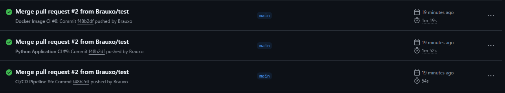
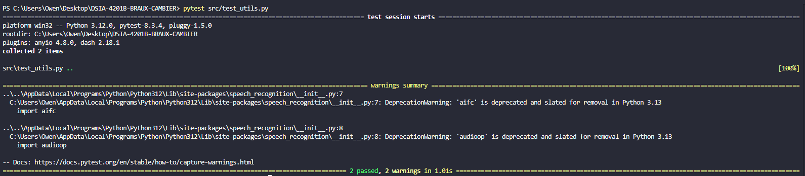

 


# **Projet DEVOPS-CHATBOT**

## **Vidéo :**


## **Auteurs**

**ESIEE PARIS projet DEVOPS de E4 fillière DSIA**

-   **Owen BRAUX** 
-   **Elliot CAMBIER** 

**Année 2025**

## **REQUIREMENTS**

Attention pour faire tourner ce projet dans des conditions optimale il est nécessaire d'avoir : 

- Un processeur multicoeur ou une carte graphique avec 4 Gb de VRAM. 
- Au moins 8 Gb de RAM (12 si CPU)

(si c'est insuffisant il faut utiliser [llama3.2:1b](https://ollama.com/library/llama3.2))

## **Description**

Une application web permettant d'accéder à un assistant (CHATBOT) utilisant un modèle LLM (Large Language Model) de votre choix, avec le modèle **llama3.2** utilisé par défaut. Cette application offre des fonctionnalités d'interaction en langage naturel via texte ou microphone, ainsi que la possibilité de sauvegarder et télécharger l'historique des conversations.

Ce projet utilise **GitHub Actions** pour l'intégration continue (CI) et le déploiement continu (CD), garantissant ainsi l'exécution automatique des tests, la construction et le déploiement de l'application. 


## **Sommaire**
1. [Prérequis](#1---prérequis)
2. [Installation](#2---installation)
3. [Exécution](#3---exécution-en-local)
4. [Déploiement avec Docker](#4---déploiement-avec-docker)
5. [Déploiement avec Kubernetes](#5---déploiement-avec-kubernetes)
6. [Fonctionnalités](#6---fonctionnalités)
7. [Pipelines et tests](#7---Pipelines-et-tests)
---

## **Guide de l'utilisateur**

### **1 - Prérequis**

#### **I -Pour un Setup sur VM/Cloud**

1. **Setup up Docker :**
 **[Docker Desktop](https://www.docker.com/products/docker-desktop/)**

2. **Setup up minikube (avec Kubernetes) :** 
 **[Kubernetes](https://kubernetes.io/releases/download/)**
 **[Minikube](https://minikube.sigs.k8s.io/docs/start/?arch=%2Fwindows%2Fx86-64%2Fstable%2F.exe+download)**

3. **Cloud**
 - L'application peut être deployée sur une plateforme cloud (AWS/Azure/etc...) grâce à Docker ou Kubernetes.


#### **II -Pour une installation locale**

1. **[ollama](https://ollama.com/)**
 - Installez Ollama pour accéder aux modèles LLM.
 - Documentation Python pour Ollama : [ollama-python](https://github.com/ollama/ollama-python).

2. **[Git](https://git-scm.com/)**
 - Nécessaire pour cloner le projet depuis le dépôt GitHub.

3. **[MongoDB](https://www.mongodb.com/docs/manual/installation/)**
 - Pour créer nos bases de données qui vont être accéder par le chatbot

4. **[FFmpeg](https://ffmpeg.org/download.html) [NON NECESSAIRE (SAUF SI L'AUDIO EST SOUHAITE)]**
 - Permet de lire et de traiter les fichiers audio.
 - Vous pouvez utiliser ce dépôt pour obtenir une version précompilée : [FFmpeg Builds](https://github.com/BtbN/FFmpeg-Builds/releases).
 - Ajoutez **ffmpeg.exe** à votre `PATH` pour un accès global.

---

### **2 - Installation**

Clonez le projet et installez les dépendances :

```sh
git clone https://github.com/Brauxo/PROJET-CHATBOT
cd PROJET-CHATBOT

pip install -r requirements.txt
```

* * * * *

### **3 - Exécution en local**

#### **Pour lancer l'application en local (sur son pc):**

1.  Assurez-vous que les modèles LLM nécessaires sont téléchargés via Ollama et que Ollama soit lancé :
```
ollama start
```
Nous conseillons llama3.2 ou llama3.2:1b . 
En alternative : Le modèle DeepSeek-R1:1.5B, récemment lancé, est particulièrement intéressant car il nécessite très peu de puissance et offre des performances correctes. 
```
ollama run llama3.2 
```

2. Setup de la base de données.

Lancer une base de données sur [MongoDB Compass]()

Pour créer une base de données avec celle fournie (le json)
```
python load_json.py
```

De plus dans le fichier config.py il faut remplacer MONGO_URL par l'adresse locale de mongoDB : 
```
MONGO_URL = "mongodb://localhost:27017/"
```

3.  Exécutez l'application Streamlit (obligatoire !) :

```
streamlit run App.py
```

4.  Accédez à l'interface via votre navigateur à l'adresse : http://localhost:8501


### **4 - Déploiement avec Docker**

Pour exécuter le projet sur Docker, il suffit de rentrer les deux commandes suivante
!!! IMPORTANT : L'initialisation du docker prend du temps (environ 10 minutes sur mon pc)
```
docker build -t chatbot-app .
```
```
docker compose up -d
```

L'app est désormais accessible sur ce lien.

http://localhost:8501

* * * * *

### **5 - Déploiement avec Kubernetes**

Pour le déploiement avec Kubernetes, nous utilisons minikube.


### **6 - Fonctionnalités**

L'application offre les fonctionnalités suivantes :

1.  **Discussion avec Albert, un Chatbot qui aide les élèves** :
    -   Dans l'onglet CHATBOT, vous avez accès à un terminal de discussion avec le modèle. 

2.  **Effacement des données** :
    -   Réinitialisez facilement l'historique des conversations à tout moment.

3.  **Gestion de l'historique des conversations** :
    -   L'historique complet de la conversation est affiché ou réduit à la dernière réponse du bot.
    -   Téléchargez l'historique en format texte pour une sauvegarde locale.

4.  **Ajout/Supression de cours directement dans l'appli** :
    -   Dans l'onglet Gestion de cours, nous pouvez ajouter des cours dans la BDD au format texte.

5.  **Fonctionalité /search <cours> pour avoir un résumé du cours** :
    -   Le chatbot va analyser le cours et résumé les points clés de celui-ci.

6.  **Interaction via texte ou voix [DESACTIVE SUR DOCKER]**:
    -   Entrez vos messages via le clavier ou utilisez le microphone pour une interaction vocale.

7.  **Conversion texte-parole [DESACTIVE PAR DEFAULT]** :
    -   Les réponses du chatbot peuvent être lues à haute voix via un moteur de synthèse vocale.
    -   reactivable mais demande une compréhension du code.


### **7 - Pipelines et tests**

#### Utilisation d'outil CI/CD avec GitHub Actions

Ce projet contient plusieurs pipelines afin de veiller au bon fonctionement de l'application lors des pulls requests sur GitHub, voici une expliquation rapide des tests :

**ci-cd.yml** : Ce pipeline définit les tâches de base du CI, telles que l'extraction du code, l'installation des dépendances et l'exécution des tests.
**docker-image.yml** : Ce pipeline vérifie la création de l'image Docker chatbot app et qu'elle peut être déployée.
**python-app.yml** : Cette pipeline vérfie le lancement de l'application python sous streamlit et son fonctionnement.

Au final, nous avons décidé de combiner ces pipelines en un unique "grand test" afin d'éviter de trop utiliser les serveurs de github, 
ce fichier est **test.yml** ! 

Normalement si tout se passe comme prévu, nous devons obtenir ce résultat : 


#### Tests Unitaires : 

Afin de tester la communication dans la partie backend du projet avec MongoDB et ollama, nous avons créer un fichier **test_utils.py** présent dans src,
ce test utilise pytest pour s'assurer du bon fonctionenment de le la partie backend de l'application (Mongo/Ollama).

On peut l'excuter avec cette commande : 
```
pytest src/test_utils.py
```

Si tout se passe corectement, on doit avoir ce résultat : 


Nous avons choisis de lancer le test sur Python 1.13 pour montrer la nécessité d'utiliser la version 3.9 qui évite plusieurs warning sur la partie audio du projet.


* * * * *


